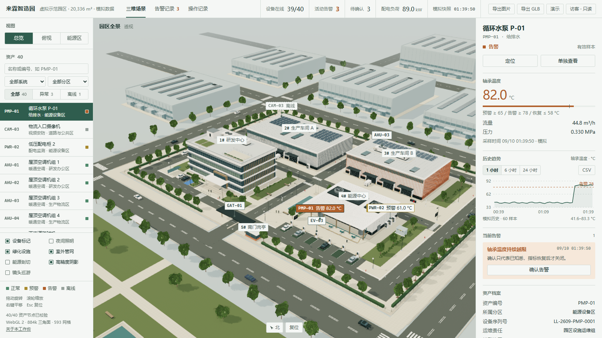
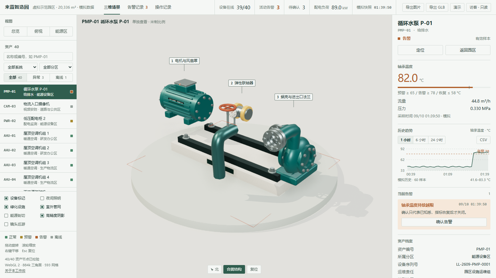
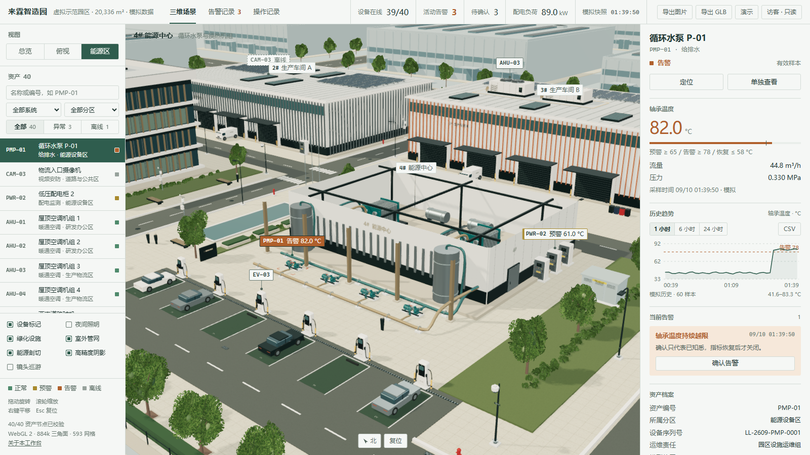
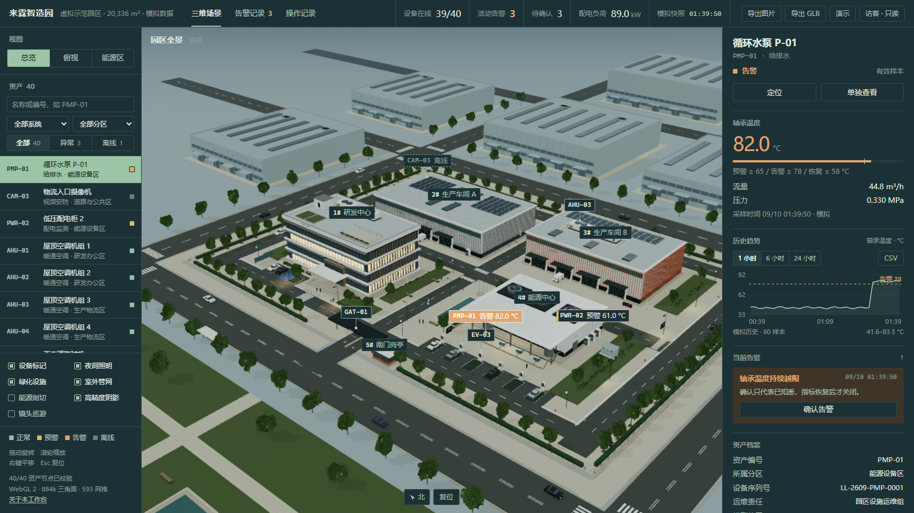
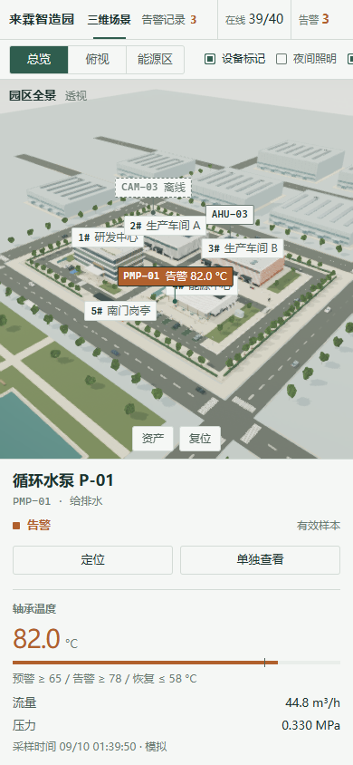

# ParkStudio-3D

园区资产三维监测与运维参考实现。Three.js 前端、Python 标准库服务、SQLite 历史与审计；可选 Modbus 采集程序负责设备读取。

[在线模拟展示](https://parkstudio-3d.vercel.app/) · [验证报告](docs/QA_AND_BENCHMARKS.md) · [Modbus 试点](docs/MODBUS_PILOT.md) · [能力与交付说明](docs/CAPABILITY.md)



“来霖”是虚拟示范园区，场景与资产为参数化设计，不对应现实客户。在线静态展示使用模拟数据。当前工作副本增加了 Modbus 协议模拟链路；实物设备和现场项目尚待验证。

## 三个可以检查的行为

- **确认不等于恢复。** 操作员确认告警后，越限仍保留；读数达到恢复条件后才关闭。SQLite 条件唯一索引避免同一设备/规则同时存在重复活动告警。
- **重复请求不重复执行模拟动作。** 道闸与照明命令使用 `Idempotency-Key`，前端等待模拟回执；回执与状态读数在同一事务中更新。gateway 模式不开放实物控制。
- **迟到读数不能把设备恢复在线。** 超过 15 秒的迟到采样只写历史；缺测桶保留空值，曲线不跨缺测连线。采集失败不补零，也不拿旧读数刷新采样时间。

证据、日期和适用环境见 [QA](docs/QA_AND_BENCHMARKS.md)。这些行为不代表所有设备、协议或生产环境都已验证。

## 两种交付

| 版本 | 使用方式 | 数据与运行条件 |
|---|---|---|
| 静态预览 | 打开 `index.html`，或把四个前端文件放到任意静态托管 | 固定模拟快照，40 个虚拟资产；只读，不采集设备 |
| 本机监测 | 浏览器 + Python 服务 + SQLite；按需启动采集程序 | 核心服务只用标准库；Modbus 采集另需 PyModbus 与 pyserial |

前端成品是同目录的四个文件：`index.html`（页面结构）、`studio.css`（样式）、`preview-data.js`（模拟快照与历史）、`preview-runtime.js`（Three.js 场景与交互）。静态预览和本机服务版用的是同一组文件，服务版在 `index.html` 里注入实时模式标记。成品不需要 Node.js 或 CDN，可以从本地磁盘直接打开；维护构建需要 Node.js。

## 运行

只看园区模拟工作台：

```powershell
python server.py --host 127.0.0.1 --port 8767
```

也可双击 `启动园区.cmd`。本机模拟账号为 `operator` / `lailin-demo-2026`，只用于本机演示。当前默认数据库为 `data/park-v2.1.sqlite3`，旧 `park.sqlite3` 保留。停止脚本只停止本项目启动器记录的服务。

运行完整 Modbus TCP 协议模拟：

```powershell
python -m venv .venv-modbus
.\.venv-modbus\Scripts\python.exe -m pip install -r adapters\requirements.txt
.\.venv-modbus\Scripts\python.exe tools\run_modbus_pilot.py
```

本地交付包可双击 `启动Modbus演示.cmd`，依赖从包内 wheelhouse 离线安装。页面默认 `http://127.0.0.1:18868`，独立随机登录凭据保存于 `data/modbus-simulator/access.json`。该目录不应公开。按 Ctrl+C 停止本次启动的三个进程。

ENV-01 是台架温湿度探头：温度用于趋势与告警，湿度仅实时显示；其位置是虚拟展示位置。模拟器参照建大仁科 RS-WS-N01-8-T 的寄存器定义。实物 RTU 使用独立配置、状态与数据库，详情见 [点表与运行说明](docs/MODBUS_PILOT.md)、[硬件准备单](docs/MODBUS_HARDWARE.md)。

## 网关接口

`POST /api/telemetry` 接收带 `Authorization: Bearer <网关密钥>` 的 JSON：

```json
{"samples":[{"deviceId":"ENV-01","sampleAt":1790000000000,"seq":1001,"metrics":{"temperature":25.0,"humidity":56.0}}]}
```

上例时间仅说明格式，实际需使用当前采集时间。每批 1–40 条、每设备单调序号、必须包含主指标；可补录 30 天内历史，超前不能超过 5 秒。返回 `applied` / `duplicate` / `late`；同序号不同时间或主值冲突，非法批次整体拒绝。HTTP 200 不等于每个样本都刷新了实时状态。

手动启动网关需设置 `LAILIN_MODE=gateway`、独立 `LAILIN_DB`、12 字符以上独立操作员密码和 24 字符以上网关 token。`LAILIN_GATEWAY_KIND` 为 `modbus-simulator`、`modbus-rtu` 或 `unverified`；来源不能在同一数据库中混用。完整示例由试点启动器生成。

| 接口 | 用途 |
|---|---|
| `GET /health` | 服务身份、数据库可读性及采样循环健康 |
| `GET /api/assets`、`/api/bootstrap`、`/api/stream` | 目录、完整快照、SSE |
| `GET /api/devices/{id}/history` | 主指标聚合历史，单次最多 7 天 |
| `GET /api/alarms`、`/api/audit` | 告警与操作记录 |
| `POST /api/auth/login` | 会话和 CSRF Token |
| `POST /api/alarms/{id}/acknowledge` | 确认知悉，不代替恢复 |
| `POST /api/commands` | 模拟道闸/照明命令，需幂等键 |
| `POST /api/telemetry` | gateway 鉴权接入 |

## 场景与交互

| 水泵结构展开 | 能源中心剖切 |
|---|---|
|  |  |

| 夜间照明 | 390 × 844 窄屏 |
|---|---|
|  |  |

界面按桌面工程软件布局：顶栏放运行读数，左侧栏放视图切换、资产列表和图层开关，右侧检查器放读数、趋势、告警和资产档案，三维画面占中间区域。设备在场景里用“编号标签 + 引线 + 落点”标注。日间和夜间两套配色随光照切换。窄屏时左侧栏收成一行工具条，检查器变成底部面板。

场景包括五栋建筑（1# 研发中心、2#/3# 生产车间、4# 能源中心、5# 南门岗亭）、道路与停车、行道树与灌木、水景、室外供回水管和街道设施（消防栓、井盖与雨水篦、路灯、挡车柱、非机动车棚、箱式变电站、垃圾分类点），共约 88 万三角面、593 个网格。研发中心按朝向做遮阳：南面水平遮阳板，东西面竖向遮阳翼，北面窗间墙。

支持资产搜索/定位、单独查看、水泵结构展开、能源中心剖切、日夜、巡游、PNG 和 GLB 导出。截图为 2026-09-28 当前版本在 Edge（Intel UHD 770 / D3D11）下的实际渲染；性能和导出记录的适用范围见 QA，不据此承诺所有工控机帧率。

## 开发与复验

```powershell
npm ci
npm run build
python tests/e2e_modbus.py
```

E2E 需要系统 Python 的 Playwright 与 Edge；采集子进程使用 `.venv-modbus`。它启动真实 TCP 模拟设备、独立采集进程与浏览器，输出 JSON、日志、CSV、截图、视频、trace 和文件哈希。实物验证不由软件测试代替。

`src/template.html` 是页面结构，`src/studio.css` 是样式；`src/catalog.js` 是资产目录源；`src/seed.json` 只用于模拟展示；`src/app.js` 处理业务交互；`src/architecture.js`、`src/landscape.js`、`src/equipment.js` 分别生成建筑、场地和设备几何；`server.py` 负责状态、规则、历史与审计；`adapters/` 是可选采集程序。`npm run build` 生成 `index.html`、`studio.css`、`preview-data.js`、`preview-runtime.js` 和 `catalog.json`。

## 已知边界

- RTU 代码与配置已提供，未接实物；MQTT、BACnet、ONVIF、PLC 现场调试和实物控制未验证。
- 温度为本台架点位唯一历史主指标，湿度不提供历史曲线；只有一个待确认样本重试缓冲，不保证长时间断网期间所有读数无损补传。
- Docker/Caddy 配置已提供，当前未实际启动容器；公网实时后端、真实手机、低配工控机长时间性能、多用户负载需在目标环境验收。
- 场景没有实物测绘或制造尺寸校核。历史 GLB 结构检查不代表所有 CAD/BIM 软件往返兼容。
- 客户项目按书面点表和验收范围实施，开源代码与演示不构成完整 BMS/MES 产品交付。

本项目采用 [MIT License](LICENSE)。Three.js、esbuild 说明见 [第三方许可](THIRD_PARTY_LICENSES.txt)；可选采集依赖的许可证保留在随包 wheel 中。
