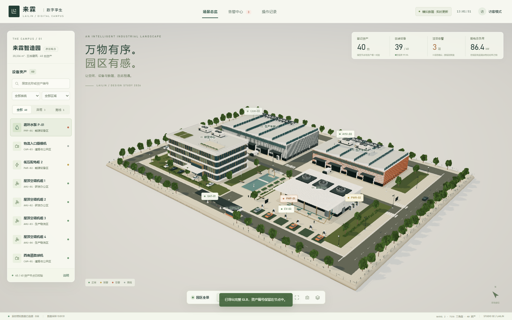
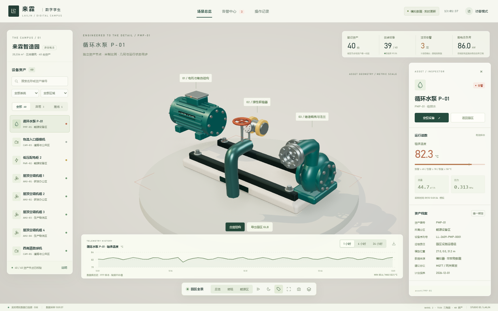
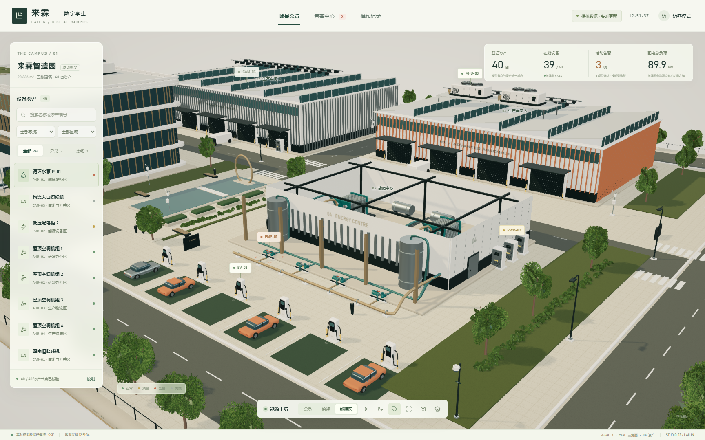
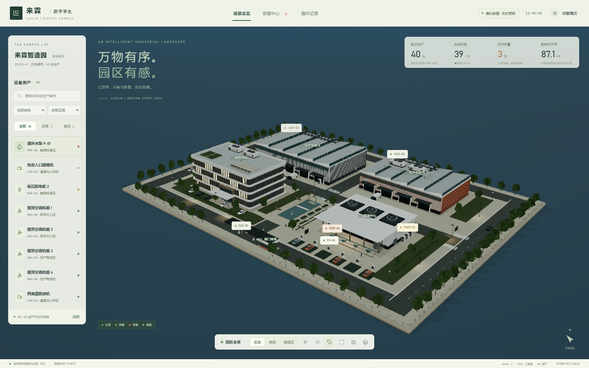
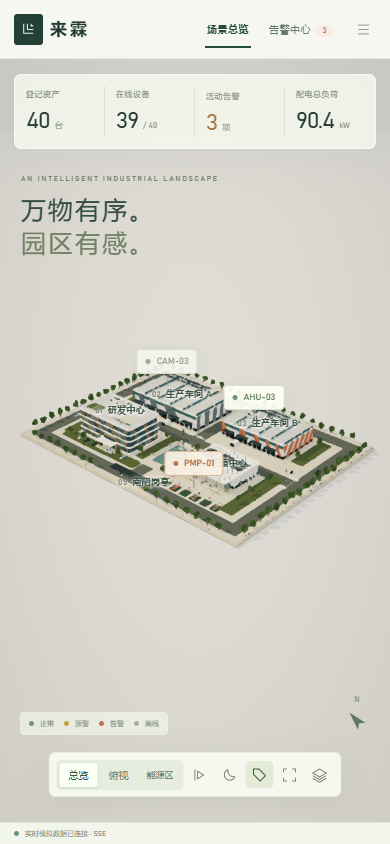

# 🏢 ParkStudio-3D

### 新一代轻量级智能园区三维数字孪生管控中心

**A lightweight 3D digital twin and SCADA-style operations workbench for smart campuses.**

[在线体验 Demo](https://parkstudio-3d.vercel.app/) · [离线单文件预览](./lailin-park-preview.html)

[快速开始](#快速开始) · [系统架构与数据流拓扑](#系统架构与数据流拓扑) · [质量保障与实机基准](docs/QA_AND_BENCHMARKS.md) · [项目结构](#项目结构)

---

ParkStudio-3D 将园区空间、固定资产、模拟遥测、告警状态和受控模拟操作置于同一资产编号下。它提供一套可运行的浏览器三维工作台，以及一个只依赖 Python 标准库的本机运维服务。

> **虚拟示范园区声明 / Fictional Demonstration Facility**
>
> “来霖（LAILIN）”仅表示本项目中的虚拟示范园区名称，不对应现实客户、实物园区或商业资产。公开场景中的建筑、设备、铭牌、布置与材质均为参数化原创设计；开源发布边界不包含客户资料、历史备份或交付压缩包。

## 核心视觉与特性概览

<table>
  <tr>
    <td width="50%" valign="top">
      <strong>⚙️ 循环水泵结构展开</strong> 
      蜗壳、联轴器、散热筋、法兰和紧固件按资产节点组织  
      
    </td>
    <td width="50%" valign="top">
      <strong>🏭 能源中心屋顶剖切</strong> 
      供回水主管与支管、设备空间和屋顶关系一览  
      
    </td>
  </tr>
  <tr>
    <td width="50%" valign="top">
      <strong>🌙 日夜光照与工业场景切换</strong> 
      夜间投光近似、室内发光层与接触遮蔽  
      
    </td>
    <td width="50%" valign="top">
      <strong>📱 响应式移动工作台</strong> 
      390 × 844 窄屏下的场景、资产列表与检查器联动  
      
    </td>
  </tr>
</table>

## 核心能力

### 1. 全链路数据与操作闭环

- **统一物模型**：8 类动力、暖通、安防与公共设施系统，40 个唯一资产节点；模型节点、状态指示灯、历史曲线和操作记录使用同一 <code>assetId</code>。
- **服务端状态机**：异常由遥测规则判定；确认只记录知悉，只有测量值或通信状态实际恢复后才会关闭告警。
- **幂等控制与审计**：模拟道闸与道路照明控制使用 <code>Idempotency-Key</code>，等待模拟回执后再显示成功，状态和读数在同一事务中更新。
- **缺测诚实呈现**：历史查询返回均值、最小值、最大值、采样数量、来源和缺测空值；曲线不跨缺测区间连线。

### 2. 参数化资产与可追踪场景

- 整个园区的建筑、道路、管网、植被和设备由源代码参数化生成，当前场景约 71.5 万三角面。
- 不依赖外部商业模型、贴图或字体；公开发布内容保留源代码与可复现的构建入口。
- 支持导出标准 GLB，保留 40 个资产根节点、<code>assetId</code> 和模型版本信息。
- 支持能源中心屋顶剖切、水泵结构展开、设备定位、单独查看、分镜巡游与高分辨率 PNG 导出。

### 3. 轻量运行与本机部署

- 后端基于 Python 3.11+ 标准库，不需要安装 Python 第三方包。
- 前端由 esbuild 打包为独立 HTML；离线预览不依赖 CDN、网络或 Node.js 运行时。
- SQLite 使用 WAL 与事务持久化；SSE 推送完整快照，携带 <code>bootId + version</code>。
- 提供 Windows 启动脚本、Dockerfile、Compose 和 Caddy HTTPS 配置。

### 4. 面向长时运行的韧性设计

- 超过 15 秒的滞后采样只写入历史，不覆盖实时状态，也不把设备错误恢复为在线。
- 断线时保留最后一份完整快照；恢复后通过版本校验接入新数据。
- 主动触发 WebGL 上下文丢失后，渲染错误层可恢复隐藏，资产绑定和数据连接继续保留。
- 访客默认只读；操作员权限覆盖登录、告警确认、工况注入和模拟控制。

## 系统架构与数据流拓扑

~~~mermaid
flowchart TD
    subgraph Edge["设备数据采集层"]
        Simulator["内置工况模拟器 2 s 采样"]
        Gateway["外部现场网关 MQTT / Modbus / BACnet 转换"]
    end

    subgraph Server["后端运维核心 · Python 3.11+ 标准库"]
        Ingest["遥测接入 鉴权 / 序列号校验"]
        RuleEngine["阈值比对 Active / Ack / Resolved"]
        SQLite[("SQLite WAL Telemetry / Alarms / Audit")]
        SSE["SSE 完整快照 bootId + version"]
    end

    subgraph Client["前端三维工作台 · Three.js + WebGL 2"]
        Engine["场景渲染器 建筑 / 设备 / 爆炸图 / 剖切"]
        AssetTree["统一资产目录 40 个唯一节点"]
        Inspector["资产检查器 读数 / 趋势 / 告警"]
        Control["幂等控制 回执 / 审计"]
    end

    Simulator --> Ingest
    Gateway --> Ingest
    Ingest --> RuleEngine
    RuleEngine --> SQLite
    SQLite --> SSE
    SSE -->|/api/stream| Client
    Control -->|/api/commands| Ingest
    AssetTree --- Engine
    Inspector --- Engine
~~~

## 快速开始

### Windows 本机工作台

需要 Python 3.11 或更高版本。运行时不需要 Node.js 或任何 Python 第三方包。

~~~powershell
# 推荐：双击启动园区.cmd
# 或在项目目录执行：
python server.py --host 127.0.0.1 --port 8767
~~~

打开 [http://127.0.0.1:8767](http://127.0.0.1:8767)。

本机模拟模式的演示账号为 <code>operator</code>，演示密码为 <code>lailin-demo-2026</code>。该凭据仅用于本机模拟，不要用于公开网络。停止服务可双击 <code>停止园区.cmd</code>；SQLite 历史、告警和审计会保留在本地 <code>data/</code> 目录。

### 离线只读预览

直接用现代浏览器打开 <code>lailin-park-preview.html</code>，进入完全离线、固定模拟快照的只读展示版本。模型、纹理、渲染库与历史快照均已内嵌。

在线静态预览入口为 <code>index.html</code>；它与同目录的 <code>preview-data.js</code>、<code>preview-runtime.js</code> 一起即可部署到 GitHub Pages、Vercel 或其他静态托管服务。

### 构建

构建维护需要 Node.js：

~~~powershell
npm ci
npm run build
~~~

构建生成自包含的 <code>lailin-park-preview.html</code>、在线入口 <code>index.html</code> 及其静态脚本分片 <code>preview-data.js</code> / <code>preview-runtime.js</code>，另生成 <code>catalog.json</code>；Node.js 不参与成品运行。

### 容器部署

复制 <code>.env.example</code> 为 <code>.env</code>，设置独立操作员密码与网关密钥后执行：

~~~powershell
Copy-Item .env.example .env
docker compose up -d --build
~~~

容器配置已提供，但当前验证环境没有 Docker；公网域名、真实证书和容器启动结果请在目标机器上单独核验。

## 真实遥测网关接入规范

当前网关模式只接收经过鉴权的遥测数据，不连接实物设备，也不开放实物控制接口。<code>LAILIN_*</code> 是现有运行时环境变量前缀，作为兼容性标识保留；公开产品名称为 ParkStudio-3D。

~~~powershell
$env:LAILIN_MODE = 'gateway'
$env:LAILIN_DB = "$PWD\data\gateway.sqlite3"
$env:LAILIN_OPERATOR_PASSWORD = '替换为至少12字符的独立密码'
$env:LAILIN_GATEWAY_TOKEN = '替换为至少24字符的随机网关密钥'
python server.py --port 8768
~~~

上报接口为 <code>POST /api/telemetry</code>，请求需携带 <code>Authorization: Bearer &lt;网关密钥&gt;</code> 和 <code>Content-Type: application/json</code>：

~~~json
{
  "samples": [
    {
      "deviceId": "PMP-01",
      "sampleAt": 1789000000000,
      "seq": 1001,
      "metrics": {
        "temperature": 43.2,
        "flow": 44.6,
        "pressure": 0.312
      }
    }
  ]
}
~~~

采样约束：

- 每批 1–40 条；每个设备的 <code>seq</code> 必须持续递增。
- 时间戳不能超过服务时间 5 秒，最早可补录 30 天以内的数据。
- 重复采样返回 <code>duplicate</code>；较旧采样返回 <code>late</code>；最新有效采样返回 <code>applied</code>。
- 同一序列号对应不同时间或主指标时返回 <code>409 SEQUENCE_CONFLICT</code>。
- 一批数据中存在无效资产或字段时整批拒绝，避免部分应用。
- 超过 15 秒的迟到采样只写入历史，不刷新实时在线态。

### API 摘要

| 方法 / 路径 | 用途 |
|---|---|
| <code>GET /health</code> | 应用身份、数据库可读性和采样循环健康情况 |
| <code>GET /api/assets</code> | 唯一资产目录、类型、指标单位与阈值 |
| <code>GET /api/bootstrap</code> | 当前完整运行快照 |
| <code>GET /api/stream</code> | SSE 快照流，包含重连间隔和版本 |
| <code>GET /api/devices/{id}/history</code> | 历史聚合查询，最大跨度 7 天 |
| <code>GET /api/alarms</code> | 最近 100 条告警，活动告警优先 |
| <code>GET /api/audit</code> | 最近 100 条服务端操作记录 |
| <code>POST /api/auth/login</code> | 返回会话 Cookie 和 CSRF Token |
| <code>POST /api/alarms/{id}/acknowledge</code> | 确认告警并记录说明 |
| <code>POST /api/demo/scenario</code> | 模拟模式下切换告警、通信中断或健康工况 |
| <code>POST /api/commands</code> | 模拟路灯 / 道闸控制，必须有幂等键 |
| <code>POST /api/telemetry</code> | 网关模式下批量上报遥测 |

## 项目结构

~~~text
src/
├── catalog.js          # 资产、坐标、主指标与阈值的唯一目录
├── architecture.js     # 建筑、幕墙、屋顶与设备平台
├── equipment.js        # 八类设备与水泵机械细节
├── landscape.js        # 道路、园林、街道设施与管网
├── geometry.js         # 几何构件、材质纹理与静态合批
├── viewer.js           # 相机、灯光、渲染、剖切、巡游与 GLB 导出
├── app.js              # 资产检查器、快照校验、运维动作与重连
├── studio.css          # 工作台视觉布局与响应式样式
└── template.html       # HTML 外壳与界面文案
server.py               # 会话、遥测、规则、历史、审计与回执
build.mjs               # esbuild 独立打包脚本
docs/assets/            # 随仓库发布的精选截图
docs/QA_AND_BENCHMARKS.md
                        # 质量保障与实机基准测试报告
~~~

## 质量保障与实机基准

完整结果见 [质量保障与实机基准测试报告](docs/QA_AND_BENCHMARKS.md)，其中记录：

- 约 71.5 万三角面、40 个唯一资产节点及目录绑定校验。
- Microsoft Edge 真实 WebGL 渲染下的总览、能源区、剖切、设备精查、结构展开和日夜场景。
- 390 × 844 窄屏视口、场景交互、告警闭环、模拟控制、SSE 断线恢复和网关接入检查。
- WebGL 上下文丢失恢复、GLB 导出结构检查、历史 CSV 导出和本机部署结果。

报告同时列出 Docker、公网域名、真实设备、真实手机硬件、独立显卡、多用户负载和第三方 GLB 往返导入等尚未验证边界。

## 公开发布边界

公开仓库只保留源代码、构建配置、可运行入口、文档和 <code>docs/assets/</code> 精选截图。以下本地目录和文件由 <code>.gitignore</code> 明确排除：

- <code>output/</code>：浏览器过程截图、模型导出和结构化验证输出。
- <code>original/</code>：历史备份。
- <code>data/</code>：SQLite 数据库、会话状态和本机日志。
- <code>*.zip</code>：交付压缩包；如需下载包，应挂载为 GitHub Release Asset。
- <code>交付清单.json</code>：内部交付流程清单。

## 范围与限制

ParkStudio-3D 是可运行的虚拟园区示例和工程化底盘，不是实测测绘成果、施工图、制造图、经审查的 BIM 或完整工业控制平台。

当前不包含：

- 实物园区测绘、制造尺寸、工艺校核和设备选型。
- MQTT、Modbus、BACnet、ONVIF 等现场协议的实际联调。
- 视频流、真实设备控制下发、企业 SSO/RBAC、多租户、工单系统和高可用生产集群。
- 真实手机、其他浏览器、独立显卡和多用户负载下的全面性能认证。
- GLB 在 Blender、CAD/BIM 软件或其他第三方查看器中的往返导入认证。

默认模拟器按 2 秒采样 40 个资产，一天约产生 172.8 万条原始数据；长时间运行应按采样频率、保留策略和实际规模评估存储。高精度接触遮蔽会增加集显负载，可在图层菜单中切换。

## 商业应用与授权协议

ParkStudio-3D 可作为工厂车间、智慧楼宇、水利水务或数据中心等三维运维项目的起始底盘，用于资产建模、节点映射、状态与告警展示、历史查询、受控模拟、明确协议的操作界面和独立部署。现场协议适配、生产安全评估、数据治理与验收标准应由具体项目另行定义。

本项目按 [MIT License](LICENSE) 发布。运行时使用 Three.js（MIT），构建使用 esbuild；第三方许可见 [THIRD_PARTY_LICENSES.txt](THIRD_PARTY_LICENSES.txt)。原创场景、模型、材质与界面由本项目程序生成，使用时仍应遵守本项目许可证及所引入依赖的许可条款。
